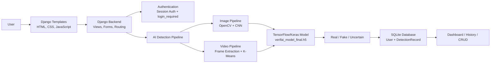
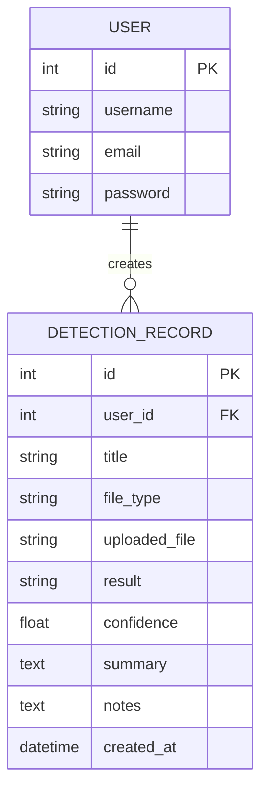

<div align="center">

# VerifAI

### AI-Based Deepfake Detection System for Images and Videos

VerifAI is a full-stack Django web application that detects deepfake content in uploaded images and videos using a TensorFlow/Keras CNN model, OpenCV preprocessing, and K-Means based video keyframe selection.


</div>

---

## Project Overview

Deepfake images and videos are becoming increasingly realistic, making it difficult to manually verify whether digital media is authentic or manipulated. VerifAI solves this problem by providing a web-based system where users can upload media, run AI-based analysis, and store detection reports for future review.

The system classifies uploaded content as:

- `REAL`
- `FAKE`
- `UNCERTAIN`

It also includes authentication, database-backed history, CRUD operations, and a professional user interface for demonstration and academic evaluation.

---

## Key Features

- Image deepfake detection
- Video deepfake detection
- CNN-based feature extraction
- OpenCV image and video preprocessing
- K-Means keyframe selection for efficient video analysis
- User login, signup, and logout
- User-specific detection history
- CRUD operations on saved reports
- Async frontend-backend communication using JavaScript `fetch`
- Django admin support
- Professional dashboard and report UI

---

## Technology Stack

| Technology | Purpose |
|---|---|
| `Python` | Core programming language |
| `Django` | Web framework, routing, views, forms, authentication |
| `SQLite` | Local database for users and detection records |
| `Django ORM` | Python-based database communication |
| `TensorFlow / Keras` | CNN model inference and training |
| `OpenCV` | Image decoding, resizing, video frame extraction |
| `scikit-learn` | MiniBatch K-Means clustering for video keyframes |
| `NumPy` | Array processing, probabilities, distances, frame batches |
| `HTML / CSS / JavaScript` | Frontend interface and interactions |

---

## System Architecture



---

## Detection Workflow

### Image Pipeline

```text
Uploaded Image
    -> OpenCV decoding
    -> Resize to 224 x 224
    -> Normalize pixel values
    -> TensorFlow CNN prediction
    -> Real / Fake / Uncertain result
```

### Video Pipeline

```text
Uploaded Video
    -> OpenCV frame extraction
    -> Frame sampling
    -> CNN feature embeddings
    -> MiniBatch K-Means clustering
    -> Representative keyframe selection
    -> Aggregated CNN prediction
    -> Real / Fake / Uncertain result
```

---

## Database Design



The system uses Django's built-in `User` model and a custom `DetectionRecord` model. Each user can create multiple detection reports, while each report belongs to exactly one user.

---

## CRUD Functionality

| Operation | Implementation |
|---|---|
| Create | A report is saved after every successful analysis |
| Read | Dashboard and history pages display saved reports |
| Update | Users can edit report title and notes |
| Delete | Users can remove saved reports |

Update and delete actions use internal JSON endpoints with JavaScript `fetch`, giving the project clear frontend-backend communication.

---

## Project Structure

```text
Verifai_project/
├── detector/
│   ├── models.py          # DetectionRecord model
│   ├── views.py           # Django views and CRUD endpoints
│   ├── forms.py           # Login, signup, upload, update forms
│   ├── services.py        # Image/video AI detection logic
│   └── urls.py            # App routing
├── verifai_web/
│   ├── settings.py        # Django settings
│   └── urls.py            # Project routing
├── templates/
│   ├── auth/              # Login and signup pages
│   └── detector/          # Dashboard, detect, history, about pages
├── static/
│   ├── css/styles.css     # UI styling
│   └── js/app.js          # Preview, loading, async CRUD
├── models/
│   ├── verifai_model_final.h5
│   └── verifai_model_meta.json
├── media/                 # Uploaded files
├── submission_pack/       # Report, PPT, diagrams, viva content
├── manage.py
└── train_model_final.py
```

---

## Run Locally

### 1. Clone the repository

```bash
git clone https://github.com/Harshh1306/VERIF-AI.git
cd VERIF-AI
```

### 2. Create and activate virtual environment

```powershell
python -m venv venv
venv\Scripts\activate
```

### 3. Install dependencies

If your environment already contains the required packages, you can skip this step. Otherwise install:

```powershell
pip install django tensorflow opencv-python scikit-learn numpy
```

### 4. Apply migrations

```powershell
python manage.py migrate
```

### 5. Create admin user

```powershell
python manage.py createsuperuser
```

### 6. Start local server

```powershell
python manage.py runserver
```

Open:

```text
http://127.0.0.1:8000/
```

Admin panel:

```text
http://127.0.0.1:8000/admin/
```

---

## Model Training

The project includes a training script for improving the image classification model:

```powershell
python train_model_final.py
```

Optional smoke run:

```powershell
python train_model_final.py --sample-limit 2048 --train-head-epochs 1 --train-full-epochs 1
```

Expected outputs:

- `models/verifai_model_final.h5`
- `models/verifai_model_meta.json`
- `models/verifai_training_report.txt`

---

## Internal API-Style Endpoints

The project is primarily a Django template-based application, but it also includes internal JSON endpoints for asynchronous CRUD actions.

| Endpoint | Method | Purpose |
|---|---|---|
| `/history/<id>/update/` | `POST` | Update report title and notes |
| `/history/<id>/delete/` | `POST` | Delete a report |

Example response:

```json
{
  "ok": true,
  "message": "Report updated successfully."
}
```

---

## Security Features

- Django session-based authentication
- Password hashing through Django auth
- CSRF protection on forms
- `login_required` protected routes
- User-specific record filtering with `user=request.user`
- Backend validation for uploaded media

---

## Key Outcomes

- Built a complete AI-powered full-stack web application
- Integrated a deep learning model into Django
- Implemented database-backed user reports
- Added CRUD and frontend-backend communication
- Improved video analysis using keyframe selection
- Created a project suitable for portfolio, viva, and academic demonstration

---

## Future Scope

- Improve accuracy with larger and cleaner datasets
- Add Django REST Framework APIs
- Add PostgreSQL for production deployment
- Move media files to cloud storage
- Add temporal video inconsistency detection
- Add analytics dashboard for admin users

---

## Author

**Harsh Shah**

GitHub: [Harshh1306](https://github.com/Harshh1306)

---

## Repository

[https://github.com/Harshh1306/VERIF-AI](https://github.com/Harshh1306/VERIF-AI)

